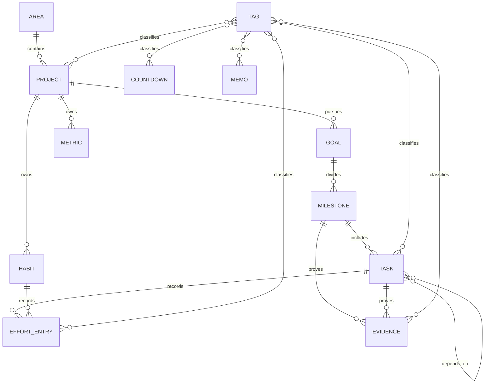
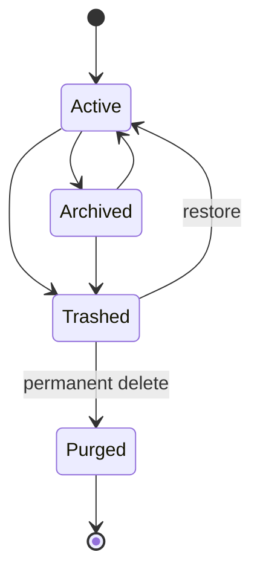
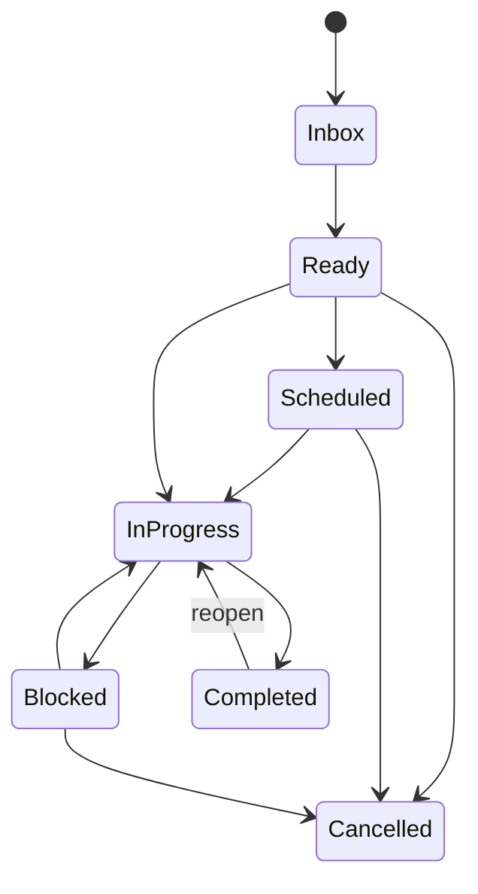
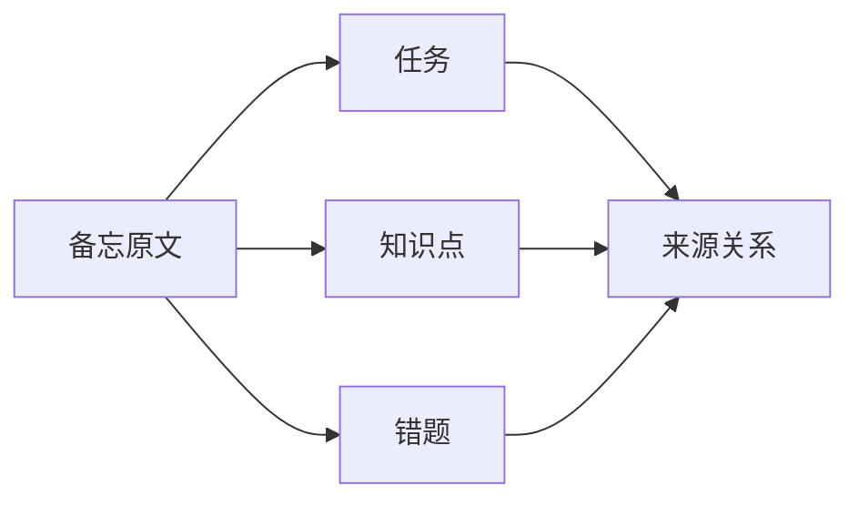

# 有迹（YouTrace）v1 领域模型与逻辑关系

本文定义有迹的核心实体、关系、状态流转和不可破坏的业务规则。开发和测试应以这些逻辑为准，避免页面各自计算进度、删除数据或解释状态。

## 1. 领域边界

有迹使用一个本地应用和一个工作区数据库，但在代码中划分清晰的业务上下文。

| 上下文 | 负责的概念 |
|---|---|
| 规划 | 领域、项目、目标、里程碑、任务、计划、依赖 |
| 执行 | 时间块、计时会话、努力记录、习惯实例、指标记录 |
| 证据 | 成果、附件、验证状态、外部反馈 |
| 学习 | 教材、章节视图、知识点、错题、测试、复习 |
| 时间 | 倒计时、工作日、提醒、风险和容量 |
| 整理 | 标签、搜索、保存视图、模板 |
| 复盘 | 周期快照、延期原因、调整决策 |
| 工作区 | 根目录、数据库、文件、迁移、备份、回收站 |

上下文可以引用其他上下文的稳定 ID，但不能直接修改对方的数据表。

## 2. 核心关系图

核心层级组织计划，横向关系连接行动、证据和分类。



课程、读书和健身不是独立的顶层数据库模型。它们通过项目模板、扩展字段和领域化视图复用相同的计划与执行实体。

## 3. 实体职责

每个实体只负责一种核心事实。

| 实体 | 核心职责 | 不能承担的职责 |
|---|---|---|
| Area | 长期领域分类 | 计算项目进度 |
| Project | 聚合一段工作 | 保存每次计时明细 |
| Goal | 定义成功标准 | 直接代表一次行动 |
| Milestone | 定义阶段成果和权重 | 充当普通备忘 |
| Task | 表达一次可执行行动 | 直接保存累计实际时长 |
| Habit | 定义重复行动规则 | 覆盖每次历史实例 |
| Metric | 定义数值目标 | 替代任务完成状态 |
| EffortEntry | 保存一次真实投入 | 随任务删除而删除 |
| Evidence | 支持验证结果 | 自动证明掌握度 |
| Memo | 捕捉和整理信息 | 默认进入执行计划 |
| Countdown | 表达时间压力 | 成为唯一的任务期限来源 |
| Review | 保存周期快照和决定 | 修改历史努力事实 |
| Tag | 横向分类和统计 | 替代状态、项目或层级 |

## 4. 通用标识和生命周期

所有业务对象使用不可变的唯一 ID，并保存创建、修改、归档和软删除时间。

默认生命周期为：



软删除解除对象在正常查询中的可见性，但保留关系和历史。永久删除前必须检查努力记录、证据、附件和依赖关系，并向用户展示影响范围。

## 5. 任务状态

任务状态与证据状态分离。



关键规则如下：

- 启动计时可以把待办任务改为进行中。
- 停止计时不能自动完成任务。
- 完成任务需要完成时间，但不需要自动创建证据。
- 重新打开任务保留原完成时间历史，并记录新状态。
- 取消任务需要可选原因，已经发生的努力仍参与历史统计。

## 6. 成果验证状态

成果证据使用递进状态，但允许降级并保留原因。

```text
已准备 → 已完成 → 已验证 → 已认可
```

- 已准备表示材料或框架存在。
- 已完成表示预期产物已经形成。
- 已验证表示用户实际检查、运行、测试或复现。
- 已认可表示老师、客户或其他外部主体确认。

任务状态和证据状态不能自动相互映射。“任务已完成、证据已准备”是合法组合。

## 7. 进度传播

进度由底层事实向上计算，页面不能保存互相冲突的百分比副本。

### 7.1 任务完成比例

普通任务的完成比例默认为 0 或 1。存在纳入计算的子任务时，父任务按子任务权重计算。

检查清单只在任务明确选择“按检查清单计算进度”时参与比例，否则只作为步骤提示。

### 7.2 里程碑进度

里程碑按纳入计算的任务汇总。没有任务时，其状态映射为 0 或 1；已取消且标记“不计入进度”的里程碑从分母移除。

### 7.3 项目双进度

项目同时计算等权进度和工作量进度。主显示模式只影响界面，不改变底层权重和历史。

- 等权进度对所有纳入计算的里程碑使用相同权重。
- 工作量进度使用里程碑手动权重；未设置时使用预计时间；两者都没有时使用 1。

切换主模式不能改写任务、里程碑或记录。

### 7.4 掌握度

掌握度是可空的 0 至 100 数值。未评估与 0 分不同，汇总时只计算已评估项目，并同时显示覆盖率。

```text
掌握度 78% · 已评估 6/10 章
```

## 8. 难度和时间逻辑

难度保存挑战程度，预计时间保存工作量，实际时间从努力记录汇总。

实际时间计算规则为：

- 只汇总有效且未作废的努力记录。
- 同一计时会话不能产生重叠记录。
- 手动补录与计时记录使用相同模型，但标记来源。
- 更正时间产生审计记录，不静默覆盖原值。
- 任务转移到另一个项目后，历史努力按发生时归属保留快照，同时关联当前任务。

## 9. 标签关系

标签通过通用关联表连接业务对象。

```text
TagAssignment(tagId, entityType, entityId, createdAt)
```

逻辑约束如下：

- 同一对象不能重复添加同一标签。
- 标签名称在未归档标签中按不区分大小写唯一。
- 删除标签只删除关联，不删除对象。
- 合并标签把来源关系迁移到目标标签并去重。
- 标签统计从关联对象和努力记录实时或增量计算，不能成为事实来源。

## 10. 依赖关系

任务依赖形成有向无环图。

创建或修改依赖时必须验证：

- 任务不能依赖自身。
- 依赖边不能形成环。
- 被软删除任务不能作为新的前置条件。
- 跨项目依赖允许存在，但界面需要显示来源项目。

跨项目依赖只影响任务是否可开始，不传播项目或任务完成进度。前置任务所在项目进入回收站后，后续任务保持阻塞并显示“前置任务位于回收站”；恢复项目后自动恢复正常关系。永久删除前置任务前，系统必须列出跨项目影响并要求用户解除或替换依赖。

强制越过未完成依赖时，系统记录时间、用户操作和原因。

## 11. 周期对象

周期任务和习惯使用“规则 + 实例”模型。

规则定义频率、时区、开始、结束和例外；实例保存某次发生的计划时间、完成状态和努力记录。修改规则只影响用户选择的未来实例，不能重写已经完成或跳过的实例。

## 12. 倒计时与风险

倒计时引用目标时间和可选业务对象，不复制关联对象的全部数据。

风险计算输入包括：

- 当前时间和目标时间。
- 工作日规则和缓冲天数。
- 关联对象的剩余工作量。
- 最近一个可配置窗口内的实际完成速度。

风险计算输出需要包含状态和原因。没有足够历史速度时，系统显示“数据不足”，不能伪造预计完成日期。

## 13. 备忘转换

备忘转换创建新对象并保留来源关系。



转换不是移动。原备忘默认保留并标记“已处理”，用户可以随后归档。

来源关系使用通用 `EntityRelation` 保存，而不是为每种转换创建直接多对多表。

```text
EntityRelation(sourceType, sourceId, targetType, targetId, relationType, createdAt)
```

备忘转换使用 `CONVERTED_TO`，目标对象反向显示 `DERIVED_FROM`。删除任一对象不会自动删除另一对象，只会把来源关系标记为不可用或随对象一起进入回收站。

## 14. 复盘与计划调整

复盘包含不可变快照和可编辑正文。

生成复盘时，系统保存周期边界、计划事项、实际投入、完成状态、延期原因和成果列表。复盘后执行的批量调整以独立变更记录保存，不能修改快照中的原值。

## 15. 文件和附件关系

数据库保存文件元数据和工作区相对路径，实际文件由工作区服务管理。

一个附件可以关联多个业务对象，但只有一份物理文件。解除最后一个关系时，文件进入待清理状态；程序不能立即永久删除，以便撤销和恢复。

详细的路径、迁移和备份规则见 [工作区与数据安全](05-工作区与数据安全.md)。

## 16. 删除和恢复不变量

以下规则在任何页面和 IPC 入口都必须一致。

- 删除父对象不能永久删除努力记录。
- 删除项目时，其结构进入回收站，独立证据和记录保留关联快照。
- 恢复对象时优先恢复原父关系；原父不存在时进入“已恢复内容”。
- 永久删除共享附件前必须确认没有其他引用。
- 统计查询默认排除已软删除结构，但历史努力报表可选择包含取消和已删除来源。

## 17. 日期与时间语义

日期和时间字段按用途区分，不能用同一种字符串隐式解释。

- 仅表示某一天的字段保存为本地日历日期 `YYYY-MM-DD`，更换时区后不自动移动到前一天或后一天。
- 表示具体时刻的字段保存为 UTC 时间，同时保存需要解释周期、工作日或提醒规则的时区。
- 工作区默认使用当前 Windows 系统时区；修改工作区时区只影响用户确认后的未来计划计算，不能改写已完成任务、努力记录和复盘快照。
- 日、周、月边界、工作日、静默时间和倒计时的“剩余天数”都按工作区时区计算。
- 夏令时或系统时钟变化导致某个本地时刻不存在或重复时，系统必须给出确定结果并记录实际触发时刻，不能重复生成同一个周期实例。
