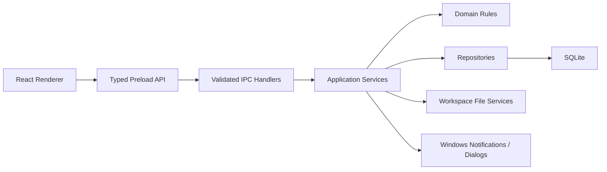

# 有迹（YouTrace）v1 技术架构

本文定义有迹 v1 的 Electron 进程边界、代码结构、模块契约、存储方式、测试策略和发布方式。架构以单机、本地优先、Windows 和可迁移工作区为约束，采用单体模块化结构，不引入服务器或微服务。

## 1. 架构约束

实现必须满足以下已确认条件。

- 只面向 Windows 桌面端。
- 使用 Electron、React 和 TypeScript。
- 默认完全离线，不需要登录。
- 一个运行实例同时只写入一个工作区。
- SQLite 是实时工作数据库，附件是工作区内的普通文件。
- 用户选择的根目录承载全部业务数据。
- v1 包含完整产品范围，但不包含 AI、云同步和协作。

## 2. 技术栈

依赖版本在项目脚手架创建时锁定；v1 实现和验收期间不得使用浮动版本改变已选技术基线。

| 层 | 选择 | 原因 |
|---|---|---|
| 桌面容器 | Electron | Windows 原生窗口、通知、文件选择和本地文件能力 |
| 语言 | TypeScript | 共享 IPC、领域模型和错误类型 |
| 界面 | React | 适合复杂状态页面和可复用视图 |
| 构建 | electron-vite / Vite | 分别构建 main、preload 和 renderer |
| 数据库 | SQLite，WAL 模式 | 单机事务、查询、迁移和本地备份 |
| SQLite 适配 | better-sqlite3 | 主进程同步事务简单；需要验证 Electron ABI 和打包 |
| 输入校验 | Zod | IPC 和导入边界的运行时校验 |
| 异步数据 | TanStack Query | 管理通过 IPC 获得的查询、刷新和失效 |
| 界面状态 | React 状态，必要时 Zustand | 只保存选中项、面板和草稿等临时状态 |
| 组件基础 | shadcn/ui 源码组件 + Radix Primitives | 保留可访问交互并完全控制视觉实现 |
| 样式 | Tailwind CSS + CSS 语义变量 | 落实浅色、深色和密度令牌 |
| 图标 | Lucide | 使用统一描边图标并按需导入 |
| 单元测试 | Vitest | 覆盖领域规则和服务 |
| 桌面端测试 | Playwright Electron | 验证真实 Electron 窗口和进程桥 |
| 打包 | electron-builder | 生成 Windows NSIS 安装版和便携版 |

`better-sqlite3` 是原生模块，官方项目说明 Electron 构建需要匹配对应运行时并正确处理原生库。因此安装包测试必须验证打包后的数据库读写，不能只测试开发模式。

## 3. 总体结构

渲染层只表达界面意图，主进程负责全部高权限操作。



禁止 renderer 直接导入 `fs`、SQLite 适配器、Electron 主进程 API 或工作区绝对路径。

## 4. 仓库结构

有迹只有一个可部署桌面应用，因此使用单仓库结构，不为未来假设提前拆分 monorepo。

```text
YouTrace\
├─ docs\
├─ resources\
│  ├─ icons\
│  └─ installer\
├─ src\
│  ├─ main\
│  │  ├─ bootstrap\
│  │  ├─ ipc\
│  │  ├─ modules\
│  │  ├─ workspace\
│  │  ├─ database\
│  │  ├─ notifications\
│  │  └─ windows\
│  ├─ preload\
│  │  ├─ api\
│  │  └─ index.ts
│  ├─ renderer\
│  │  ├─ app\
│  │  ├─ features\
│  │  ├─ pages\
│  │  ├─ components\
│  │  └─ styles\
│  └─ shared\
│     ├─ contracts\
│     ├─ schemas\
│     ├─ types\
│     └─ errors\
├─ tests\
│  ├─ unit\
│  ├─ integration\
│  ├─ electron\
│  └─ fixtures\
└─ scripts\
```

业务模块在 `src/main/modules/<module>` 内拥有自己的 service、repository、mapper、types 和 tests。共享目录只放置至少三个模块共同使用且语义一致的契约。

## 5. Electron 进程边界

Electron 官方安全指南要求启用上下文隔离和沙箱，并禁止向页面暴露原始 `ipcRenderer`。有迹采用每个业务动作一个受控方法的桥接方式。

| 进程 | 可以做什么 | 禁止做什么 | 约束方式 |
|---|---|---|---|
| Main | 数据库、文件、迁移、备份、通知、窗口 | 直接操作 React 状态 | 模块导入边界测试 |
| Preload | 暴露命名且最小的业务 API | 暴露原始 IPC、文件系统或 Electron 对象 | 类型声明和桥接快照测试 |
| Renderer | 页面、表单、图表和用户意图 | 直接读取磁盘、数据库或 Node.js | ESLint 禁止导入规则 |
| Shared | 类型、schema 和纯函数 | 导入 Electron、React 或数据库驱动 | TypeScript 项目引用 |

窗口设置为 `frame: false`、`thickFrame: false`、`transparent: false`、`contextIsolation: true`、`nodeIntegration: false`、`sandbox: true`，不保留 Windows 标准窗口框。程序不启用 `titleBarOverlay`、Acrylic、Mica 或透明背景；renderer 绘制完整标题栏、控制按钮和边缘缩放命中区，preload 只暴露最小化、最大化、还原、关闭、受控缩放和窗口状态订阅等命名 API。

标题栏拖动区和非拖动控件必须明确分离。边缘与四角缩放通过命名窗口动作交给主进程，主进程校验方向、坐标、最小尺寸和显示器可见范围；renderer 不能获得任意窗口控制能力。文件夹选择等系统对话框不受自绘窗口限制。依据见 [Electron Custom Title Bar](https://www.electronjs.org/docs/latest/tutorial/custom-title-bar) 和 [Electron BaseWindow](https://www.electronjs.org/docs/latest/api/base-window)。

应用通过受控的自定义协议加载打包资源，不直接依赖 `file://`，并限制导航、新窗口和外部链接。

## 6. IPC 契约

IPC 使用“契约先行”的请求—响应模式，通道名按领域和动作组织。

```text
workspace:create
workspace:open
workspace:migrate
task:create
task:update
effort:start
effort:stop
backup:create
backup:restore
```

每个 IPC 方法都必须定义输入 schema、输出类型、错误码、权限范围和超时行为。

统一错误结构为：

| 字段 | 含义 |
|---|---|
| code | 稳定错误码，例如 `WORKSPACE_READ_ONLY` |
| message | 可向用户展示的简明信息 |
| details | 可选的结构化上下文，不包含敏感路径以外的信息 |
| recovery | 可选的恢复动作，例如重新选择目录 |

IPC handler 只负责验证、调用 application service 和映射错误。它不能直接执行 SQL 或复制文件。

## 7. 主进程模块契约

模块按职责分层，并用导入规则和测试防止边界腐化。

| 层 | 职责 | 可依赖 | 不可依赖 | 强制方式 |
|---|---|---|---|---|
| IPC handler | 传输、校验、错误映射 | application、shared | repository、renderer | ESLint import rule |
| Application service | 编排用例和事务 | domain、repository interface、workspace service | UI | TypeScript + integration tests |
| Domain | 状态、进度和不变量 | shared pure types | Electron、SQLite、文件系统 | 独立 tsconfig |
| Repository | 数据持久化 | database、mapper | renderer、IPC | import rule |
| Workspace service | 路径、文件、锁、迁移和备份 | Node/Electron main API | renderer | integration tests |
| Mapper | 数据行和领域对象转换 | shared、domain | UI | unit tests |

工作区迁移、回收站和备份必须通过各自唯一的 application service，不能在多个 IPC handler 中复制逻辑。

## 8. 数据库架构

SQLite 数据库位于工作区内，主进程持有连接。业务写入使用显式事务，schema 通过顺序迁移升级。

核心表组包括：

- 规划：areas、projects、goals、milestones、tasks、task_dependencies。
- 执行：plans、daily_focus_tasks、time_blocks、effort_entries、habit_rules、habit_instances、metric_entries。
- 证据：evidence、attachments、entity_attachments。
- 学习：course_profiles、textbooks（兼容旧名的多资料条目表）、knowledge_items、mistakes、tests、reviews_queue。
- 时间：countdowns、reminder_rules、reminder_instances。
- 整理：tags、tag_assignments、saved_views、templates。
- 复盘：reviews、review_snapshots、plan_adjustments。
- 系统：schema_migrations、audit_events、trash_entries、workspace_settings。

数据库不保存附件绝对路径。课程资料附件通过 `entity_attachments` 的 `course_material` 关系关联到 `textbooks` 行，物理文件位于 `attachments/course-materials/`。路径规则、WAL 文件处理和备份流程见 [工作区与数据安全](05-工作区与数据安全.md)。

跨模块全文搜索使用 SQLite FTS5 的 trigram 虚拟表索引可搜索标题和正文，少于三个 Unicode 字符的查询回退到转义后的受限 `LIKE`。业务表始终是事实来源；搜索索引属于可重建派生数据，在同一 application service 写入后同步更新，并提供完整性检查和重建动作。第一条纵向切片必须在开发版、安装版和便携版中验证 FTS5 与 trigram 可用。依据见 [SQLite FTS5](https://www.sqlite.org/fts5.html)。

## 9. 查询和状态同步

主进程是业务事实的唯一来源，renderer 不维护可与数据库冲突的长期副本。

变更流程如下：

1. Renderer 通过 preload 调用命名业务动作。
2. Main 在事务中验证并写入数据。
3. Main 返回新的领域对象和受影响查询键。
4. Renderer 更新或失效对应查询。
5. 汇总进度由领域服务重新计算或按事件增量更新。

表单草稿可以留在 renderer，但保存成功前不能计入进度和统计。

列表和搜索结果使用分页或虚拟化，只把首屏及必要汇总传给 renderer，不能一次加载参考规模下的全部记录。

## 10. 工作区和文件服务

所有业务文件操作通过工作区服务完成。

工作区服务负责：

- 解析并验证工作区相对路径。
- 拒绝路径穿越、符号链接逃逸和未授权绝对路径。
- 原子写入工作区标记、设置和导出文件。
- 管理附件导入、去重、回收和恢复。
- 管理单实例锁、迁移锁和备份锁。
- 处理根目录失联、只读、空间不足和权限变化。

具体目录和状态机见 [工作区与数据安全](05-工作区与数据安全.md)。

## 11. 提醒和后台任务

提醒调度运行在主进程，使用数据库中的规则生成待触发实例。

关闭主窗口时根据工作区偏好隐藏到系统托盘或直接退出，默认隐藏到托盘并让主进程、计时和提醒调度继续运行。托盘仅提供必要入口；开发模式从仓库 `resources/icon.png` 加载图标，打包时该资源作为 `youtrace-tray.png` 放入应用资源目录，只有资源不可用时才回退到内存图标。用户选择明确退出后才结束进程。应用再次启动或从休眠恢复时重新计算错过的提醒，并按规则汇总去重。提醒失败写入日志，但不能回滚任务或倒计时数据。托盘能力依据见 [Electron Tray](https://www.electronjs.org/docs/latest/api/tray/)。

耗时的备份、完整性检查和大文件复制需要报告进度并可取消。v1 可以在主进程使用受控工作队列；如果测量证明阻塞界面，再把特定任务移入 utility process。

## 12. 安全策略

安全基线遵循 Electron 官方建议。

- 使用当前受支持的 Electron 版本并固定依赖锁文件。
- 启用上下文隔离、renderer 沙箱和严格 CSP。
- 不加载远程脚本，不启用 `webSecurity` 例外。
- 验证所有 IPC 输入和 sender。
- 不把原始 `ipcRenderer`、事件对象或任意通道暴露给 renderer。
- 外部链接经过协议和域名检查后交给系统浏览器。
- 导入包、附件名和相对路径都做规范化和边界检查。
- Markdown 禁用原始 HTML 和脚本，不自动加载远程嵌入内容；链接协议使用允许列表并经过转义。

官方依据包括 [Electron Security](https://www.electronjs.org/docs/latest/tutorial/security)、[Context Isolation](https://www.electronjs.org/docs/latest/tutorial/context-isolation) 和 [Process Sandboxing](https://www.electronjs.org/docs/latest/tutorial/sandbox)。

## 13. 测试策略

测试按业务风险分层，不能用启动成功替代功能验证。

| 层级 | 覆盖内容 | 证据 |
|---|---|---|
| 单元测试 | 进度公式、状态机、依赖环、风险和相对路径 | Vitest 通过 |
| 集成测试 | SQLite 事务、迁移、repository、备份、恢复和回收站 | 临时真实工作区通过 |
| Electron E2E | 首次启动、创建课程、计时、标签、复盘、根目录迁移 | 真实 Electron 窗口通过 |
| 打包测试 | NSIS、便携版、原生 SQLite、通知和自绘窗口 | 干净 Windows 环境证据 |
| 恢复测试 | 异常退出、WAL、只读、空间不足和迁移中断 | 数据不丢失且提示可操作 |

[Playwright Electron](https://playwright.dev/docs/api/class-electron) 支持仍标记为实验性，而且不能直接拦截原生文件对话框。测试需要在主进程中替换对话框返回值，并保留少量人工 Windows 验收。

## 14. 打包与发布

v1 使用 electron-builder 生成 Windows x64 的 NSIS 安装版和便携版。[electron-builder NSIS 文档](https://www.electron.build/docs/nsis/)支持 `nsis` 与 `portable` 目标。

发布产物至少包括：

- `YouTrace-<version>-Setup.exe`
- `YouTrace-<version>-Portable.exe`
- SHA-256 校验文件
- 版本说明
- 数据库迁移和回滚说明

安装和卸载不能静默修改用户工作区。卸载默认不删除工作区和外部 bootstrap 指针，删除行为需要用户明确选择。

## 15. 实施顺序和回滚

v1 范围不缩减，但开发按可验证纵向切片推进。

1. 工作区创建、SQLite、主/预加载/渲染桥和首页空状态。
2. 项目—里程碑—任务、标签和基础搜索。
3. 今日执行、计时、努力记录和成果证据。
4. 双进度、课程、复习、习惯和指标。
5. 日历、倒计时、提醒和复盘。
6. 模板、回收站、备份、恢复和根目录迁移。
7. 全量 Electron E2E、打包、异常恢复和发布验收。

每个数据库迁移必须有向前迁移、备份前置条件和旧版本不可打开时的明确提示。代码回滚不能尝试用旧程序直接写入较新的 schema。

## 16. 已知风险和决策门

以下风险需要在实现早期用真实纵向切片验证。

| 风险 | 验证门 |
|---|---|
| SQLite 原生模块与 Electron ABI 不匹配 | 第一切片完成安装版和便携版数据库读写 |
| WAL 复制导致备份不完整 | 先检查点或使用 SQLite 备份 API，再验证恢复 |
| 大量统计阻塞主进程 | 使用参考规模数据测量，再决定是否引入 worker |
| FTS5 trigram 在打包运行时不可用或中文短词结果不完整 | 第一切片验证 FTS5；短查询回退并进行中英文固定数据集测试 |
| 根目录位于移动盘或网络盘 | 验证失联、重连和锁行为；不支持并发共享写入 |
| 通用实体标签关系产生孤儿 | 外键、事务和完整性测试 |
| 自绘窗口在缩放、多显示器或托盘恢复时失焦 | 首条纵向切片覆盖移动、贴靠、缩放、隐藏和恢复，禁止用透明窗口规避 |
| Playwright Electron 能力不足 | 自动测试加固定的人工 Windows 验收清单 |

架构验证状态目前为 `PREPARED`。只有完成第一条纵向切片、真实打包和数据库往返测试后，技术选型才能进入 `VERIFIED`。
