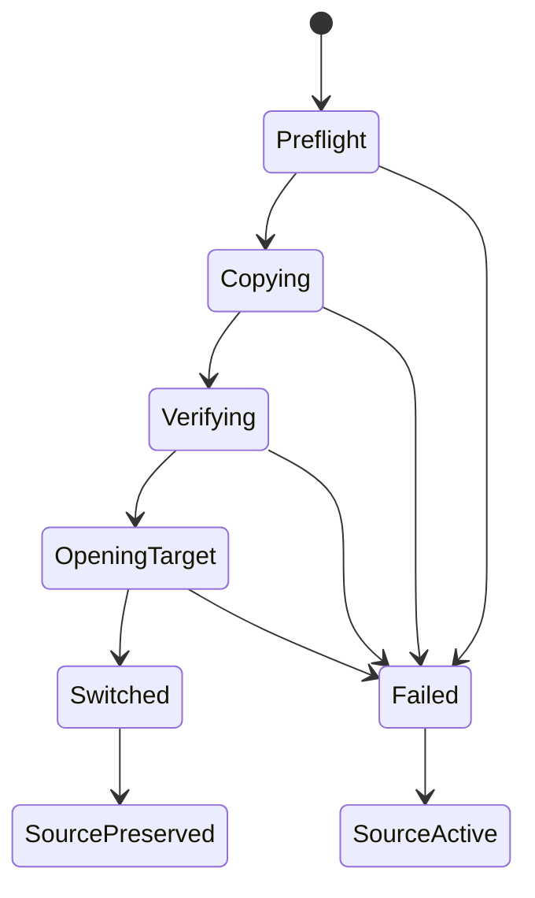

# 有迹（YouTrace）v1 工作区与数据安全

本文定义用户选择的根目录如何保存、迁移、备份和恢复有迹数据。业务数据只能写入当前工作区；根目录丢失、迁移中断或数据库异常时，程序必须停止危险写入并给出可恢复路径。

## 1. 核心决策

有迹使用“一个根目录等于一个完整工作区”的模型。用户不需要分别设置数据库、附件、备份和回收站目录。

复制整个根目录应当足以保存全部业务内容。程序不得把任务、备忘、标签、记录、附件或证据隐藏到系统用户目录。

## 2. 工作区目录

新建工作区时，程序创建以下结构。

```text
YouTraceWorkspace\
├─ .youtrace-workspace.json
├─ database\
│  └─ youtrace.sqlite3
├─ attachments\
├─ evidence\
├─ backups\
├─ exports\
├─ templates\
├─ recovery\
├─ trash\
├─ settings\
├─ logs\
├─ temp\
└─ migration-reports\
```

目录职责如下：

| 路径 | 内容 |
|---|---|
| `.youtrace-workspace.json` | 工作区 ID、格式版本、创建时间和产品标识 |
| `database/` | SQLite、WAL 和共享内存文件 |
| `attachments/` | 用户导入的普通附件 |
| `evidence/` | 作为成果证据管理的文件 |
| `backups/` | 自动和手动备份 |
| `exports/` | 用户主动导出的报表和便携包 |
| `templates/` | 用户自定义模板资源 |
| `recovery/` | 未完成草稿和恢复状态 |
| `trash/` | 可恢复的已删除文件 |
| `settings/` | 工作区级设置 |
| `logs/` | 经过隐私处理的运行与迁移日志 |
| `temp/` | 可安全重建的临时文件 |
| `migration-reports/` | 根目录和 schema 迁移报告 |

## 3. 外部启动指针

安装版需要在 `%APPDATA%\YouTrace\bootstrap.json` 保存一个最小启动指针，便携版可以把同类指针放在可执行文件旁。

该文件只允许包含：

- 最近工作区的绝对路径。
- 工作区 ID。
- 最近打开时间。
- 未完成迁移的状态和目标路径。
- 窗口位置等设备级偏好。

它不能包含任何任务、备忘、标签、附件、努力记录或成果内容。删除启动指针后，用户仍可通过“打开已有工作区”恢复全部业务数据。

## 4. 相对路径

数据库中的业务文件路径必须相对于工作区根目录。

```text
attachments/2026/07/<file-id>.pdf
evidence/2026/07/<evidence-id>.png
```

工作区服务在主进程中解析路径，并在每次读写前确认最终路径仍位于根目录。程序拒绝 `..` 穿越、非法盘符、设备路径和逃逸根目录的符号链接。

## 5. 创建工作区

新建前需要满足以下条件。

- 目标目录存在或可以创建。
- 程序具有读写权限。
- 目录为空，或用户明确选择一个新的子目录。
- 目录中不存在其他产品或不同工作区的标记。
- 磁盘具有创建数据库和初始备份的可用空间。

创建流程按顺序执行：

1. 写入临时工作区标记。
2. 创建目录结构。
3. 创建数据库并运行初始 schema。
4. 执行数据库完整性检查。
5. 原子替换正式工作区标记。
6. 更新外部启动指针。

任一步失败时，程序不得把目录登记为可用工作区。

## 6. 打开和切换工作区

打开已有目录时，程序验证标记、工作区 ID、格式版本、权限、锁和数据库完整性。

“打开”“新建”和“迁移”是三个独立动作：

- 打开切换到已存在的工作区。
- 新建创建空工作区。
- 迁移复制当前工作区到新目录。

程序禁止把两个工作区自动合并。用户选择普通文件夹时，程序不能静默把它初始化为工作区。

## 7. 工作区锁

同一工作区同一时间只允许一个有迹实例写入。

锁文件位于工作区内部，包含工作区 ID、进程 ID、设备标识摘要、启动时间和随机令牌。打开时发现有效锁，程序提供只读打开、返回或在确认进程已不存在后恢复锁。

网络共享目录和多设备同时写入不属于 v1 支持范围。

## 8. 根目录迁移

迁移采用“复制—校验—试开—切换”流程，绝不先移动或删除源目录。



预检包括目标权限、空间、路径冲突、锁和文件系统能力。复制前执行数据库检查点并关闭业务连接。

校验至少比较：

- 工作区 ID 和格式版本。
- 数据库完整性检查结果。
- 数据库记录数量摘要。
- 文件清单、大小和关键文件哈希。
- 附件引用是否都有对应文件。

只有目标工作区成功打开后才能更新启动指针。源目录保留，并写入“已迁移”提示；程序不能自动删除源目录。

## 9. 迁移中断恢复

外部启动指针和迁移报告共同保存迁移阶段。

程序下次启动时如果发现未完成迁移，需要提供：

- 返回源工作区。
- 从安全阶段继续迁移。
- 删除不完整的目标副本。
- 打开迁移报告所在目录。

默认动作是返回源工作区。程序不能根据文件时间猜测哪个目录是最新数据。

## 10. SQLite 和 WAL

SQLite 使用 WAL 模式时，`-wal` 和 `-shm` 文件可能与主数据库同时存在。SQLite 官方说明未检查点的 WAL 是持久状态的一部分，不能在数据库打开时只复制主文件。

备份和迁移必须使用以下方式之一：

- 使用 SQLite 在线备份 API 生成一致快照。
- 暂停写入、完成检查点、关闭连接后复制完整数据库状态。

程序不能通过直接复制正在写入的 `youtrace.sqlite3` 宣布备份成功。依据见 [SQLite Write-Ahead Logging](https://www.sqlite.org/wal.html)。

## 11. 自动保存和异常恢复

结构化业务操作使用数据库事务立即保存。长文本草稿在用户停止输入后写入恢复区，再按正常保存流程提交。

异常退出后，程序按顺序执行：

1. 检查工作区锁是否来自已结束进程。
2. 检查数据库和 WAL 状态。
3. 检查未提交草稿和未结束计时会话。
4. 向用户展示可恢复内容。
5. 在恢复完成前避免运行破坏性清理。

未结束计时会话需要用户确认结束时间，不能自动把整个离线时段计入努力。

## 12. 备份

自动备份默认每日一次，并在 schema 迁移和根目录迁移前强制创建恢复点。

每个备份包含：

- 一致的 SQLite 快照。
- 工作区标记和工作区设置。
- 附件与证据文件，或可验证的增量清单。
- schema 版本、创建时间和校验清单。
- 应用版本和恢复兼容性说明。

默认保留最近 7 个每日备份、4 个每周备份和 6 个每月备份，schema 或根目录迁移前的恢复点不参与自动清理。用户可以调整策略，设置页需要显示备份占用和下一次备份的预计空间。

备份内容排除 `backups/`、`exports/`、`logs/` 和 `temp/`，避免递归复制。清理旧备份时至少保留最近一个已验证可恢复的完整备份；空间不足时停止新备份并提示用户处理，不能先删除唯一可恢复副本。

## 13. 恢复

恢复是高风险操作，必须先验证再替换。

1. 验证备份标记、版本、数据库和文件清单。
2. 创建当前工作区的恢复前备份。
3. 把备份恢复到临时目录。
4. 执行数据库完整性和引用检查。
5. 原子切换到恢复结果。
6. 保留恢复报告和恢复前数据。

恢复失败时继续使用原工作区，不能留下部分覆盖状态。

## 14. 导入和导出

v1 支持两类导出。

- Markdown、CSV 等可读报表用于查看和分析。
- `.ytrace` 便携包用于完整工作区传输。

`.ytrace` 是导入、导出和备份载体，不是实时工作数据库。导入时先解包到隔离临时目录，校验清单、路径和版本，再创建新工作区；v1 不自动合并到当前工作区。

## 15. 附件导入

为了保证可迁移性，v1 导入附件时默认复制到工作区，不保存外部文件引用。

用户既可以点击文件区域选择附件，也可以把文件拖入备忘或成果表单。renderer 只把浏览器
`File` 对象交给 preload；preload 使用 Electron 的受控文件路径 API 取得来源路径，再通过
校验后的 IPC 调用统一导入服务。renderer 不直接访问文件系统。

导入流程需要：

- 清理原始文件名并生成稳定内部文件名。
- 计算哈希，允许复用已存在的相同内容。
- 写入临时文件后原子改名。
- 在文件成功后提交数据库关系。
- 失败时清理临时文件，不创建空引用。

界面可以显示原始文件名，但物理文件名使用 ID，避免同名覆盖和非法字符。原文件不会被
移动或修改；成果附件复制到工作区 `evidence/年/月/` 下，数据库只保存工作区相对路径。

## 16. 回收站

业务对象的软删除状态保存在数据库，相关物理文件移动到工作区 `trash/`。

恢复服务统一恢复数据库关系和文件，不能由某个页面单独改状态。永久清理前检查共享引用、备份状态和保留期，并显示不可恢复提示。

## 17. 根目录不可用

移动盘拔出、网络路径失联、权限变化或目录被移动时，程序进入“工作区不可用”状态。

此状态下程序：

- 停止数据库和文件写入。
- 保留内存中的未保存文本并允许复制。
- 显示原路径和重新定位入口。
- 允许选择同一工作区 ID 的新位置。
- 拒绝把空目录当作原工作区继续写入。

重新定位成功后执行完整性检查，再恢复编辑。

## 18. 空间不足和只读

每次大文件导入、备份和迁移前预估空间。发生 `disk full` 或只读错误时，事务回滚，临时文件标记为可清理，并向用户提供释放空间、改选目录或导出日志的操作。

程序不能在数据库写入失败后继续显示“保存成功”。

## 19. 数据库损坏

完整性检查失败时，程序默认只读打开或停止打开。

恢复顺序为：

1. 保留损坏文件的只读副本。
2. 尝试打开最近已验证备份。
3. 提供恢复报告和受影响范围。
4. 只有用户确认后才切换工作区。

程序不能自动删除损坏数据库或最近备份。

## 20. 隐私与日志

日志默认记录操作类型、错误码、时间、应用版本和匿名对象 ID，不记录备忘正文、任务正文和附件内容。

用户可以在设置中查看、导出和清理日志。迁移与恢复报告需要保留必要路径，但导出诊断包前应提示其中可能包含本地路径。
