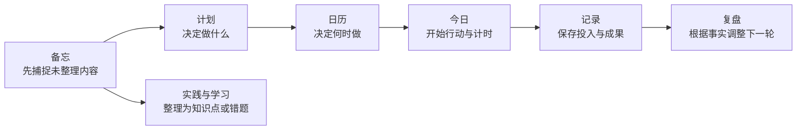

# 有迹使用教程：从计划到复盘

这份教程帮助第一次使用有迹的人建立一套不会重复填写的工作流。读完后，你会知道一条内容应该放在“计划、日历、今日、记录、备忘还是复盘”，并能用一个真实项目跑通从决定行动到回顾调整的完整闭环。

## 1. 先记住一条主线

有迹的核心不是把同一件事写进多个页面，而是让同一件事在不同阶段留下不同类型的信息。

可以用五个问题判断信息应该放在哪里：

| 你正在回答的问题 | 使用位置 |
|---|---|
| 我准备完成什么？下一步是什么？ | **计划** |
| 我准备在什么时候做？这个周期承诺哪些事项？ | **日历** |
| 我现在开始做哪一项？ | **今日** |
| 我实际上投入了多久、得到了什么结果或证据？ | **记录** |
| 我还不知道这条想法最终属于哪里吗？ | **备忘** |
| 这段时间发生了什么，下一轮应该怎样改变？ | **复盘** |

因此，你理解的“计划、日历、记录、备忘和复盘都能填写”基本正确，但还少了两个入口：

- **今日**也会在停止计时时填写实际结果、困难和下一步。
- **计划 > 实践与学习**还可以填写习惯、指标、课程、知识点、错题、测试和复习结果。

## 2. 用五步跑通最小闭环

第一次使用时，只完成下面五步。暂时不用建立复杂层级。

1. 打开 **计划 > 项目任务**，创建一个项目，再创建一条可以直接开始的任务。
2. 打开 **日历**，创建一个关联该任务的时间块。
3. 到约定时间后打开 **今日**，对这条任务开始计时；结束时填写实际结果、困难和下一步。
4. 打开 **记录**，确认努力记录已经生成；如果留下了文件、链接、成绩或反馈，再添加一项成果证据。
5. 一周结束后打开 **复盘**，生成本周快照，填写本周成果、阻塞原因和下周第一步。

如果中途出现尚未整理的想法，随时按 `Ctrl+N` 打开 **备忘**，先写下来再继续当前工作。

## 3. 理解每个页面的职责

下面的边界可以避免重复维护和统计失真。

| 页面 | 适合填写 | 不要用它代替 |
|---|---|---|
| **首页** | 通常不负责维护数据，用来查看今日重点、期限、本周投入和快速入口 | 完整的项目规划 |
| **计划** | 领域、项目、目标、里程碑、任务，以及习惯、指标和课程资料 | 已经发生的投入记录 |
| **日历** | 周期计划、时间块和倒计时 | 任务本身或任务截止日期 |
| **今日** | 开始任务、计时、停止时记录结果，以及完成、转明日、延期和阻塞 | 长期项目结构 |
| **记录** | 已发生的投入、时间更正和成果证据 | 将来准备做的事情 |
| **备忘** | 临时想法、问题、灵感、会议内容和尚未分类的信息 | 长期悬而未决的待办清单 |
| **复盘** | 周期事实快照、成果、阻塞、下一步承诺和计划调整 | 日常随手记录 |
| **标签** | 跨项目的主题分类和汇总 | 项目层级 |
| **模板** | 重复使用的项目或课程结构 | 某次行动的真实历史 |
| **更多** | 备份、导出、迁移、恢复和回收站 | 日常业务内容 |

### 3.1 计划保存“意图”

当你决定要得到某个结果时，使用 **计划**。最小结构只需要“项目 + 任务”：

- **项目**是一段有明确结果的工作，例如“完成计算机网络课程”。
- **任务**是一条可以直接开始并明确结束的动作，例如“阅读第一章并整理分层模型”。

项目较长时，再加入目标和里程碑：

- **目标**说明最终什么结果算成功，例如“期末考试达到 80 分”。
- **里程碑**说明一个阶段什么结果算完成，例如“完成第一章学习并通过章节测试”。

不要为了形式完整而创建空层级。只要你已经知道下一步，就可以先创建项目和任务并开始行动。

如果项目是一门课程，推荐按下面的方式拆分：

1. **项目 = 整门课程**，例如“网络空间安全数学原理”。
2. **里程碑 = 教材章节或课程单元**，例如“第 1 章 格的基础概念”。
3. **任务 = 这一章实际需要的学习阶段**，例如“预习第 1 章”“完成第 1 章习题”“复习易错概念”。

每章的阶段不必相同。某章可以只有“预习 + 习题”，另一章可以有“预习 + 听课 + 复习 + 测试”；创建任务时把它关联到对应的章节里程碑即可。建议先添加第一章，再只添加当前确定要做的任务，不需要一次性录完整本教材。

课程项目建好后，切换到 **计划 > 实践与学习 > 课程学习**建立课程档案。课程档案与项目一一对应，但课程内可以添加任意多个资料条目，例如：

- 主教材和参考书分别建为“教材”“参考书”；
- 教师课件建为“课件”；
- 论文或课本电子原文建为“原文 / 论文”；
- 自己整理的文件建为“笔记”。

在左侧“按课程筛选资料”中选择课程，右侧会只显示这门课的全部资料、知识点、错题、测试和复习队列。点击 **添加资料条目**填写类型、名称、作者或整理人、版本、ISBN、出版社或来源及说明。保存后，在资料卡片的附件区域点击或拖入一个或多个文件；程序会复制文件到当前工作区的 `attachments/course-materials/`，不会移动或修改原文件。双击附件名称可用系统默认程序打开。

项目名称、说明、所属领域、目标日期或进度模式需要调整时，在项目标题上方点击 **编辑项目**，修改后选择 **保存修改**。

### 3.2 日历保存“安排”

当任务已经存在，需要决定投入时间时，使用 **日历**：

- 用 **周期计划**选择年、季度、月、周或日内准备承诺的现有任务，并填写可用时间。
- 用 **时间块**为某项任务预留具体的开始和结束时间。
- 用 **倒计时**跟踪考试、交付或外部事件等硬期限。

时间块只是安排。拖动时间块不会修改任务截止日期；周期计划也只是引用现有任务，不会复制一份新任务。

### 3.3 今日保存“正在执行的过程”

当你准备立刻行动时，使用 **今日**：

1. 在“今日任务”中找到准备执行的任务。
2. 点击 **开始**启动计时。
3. 完成这一段投入后，点击 **停止并记录**。
4. 填写实际结果、困难和下一步，再保存记录。
5. 只有任务的完成标准已经满足时，才点击任务左侧明确的 **完成** 按钮。

停止计时不会自动完成任务。一次任务可以产生多段努力记录，任务也可以在尚未完成时保留真实投入。
如果任务是在程序外完成的，不需要补开计时，可以直接点击 **完成**；如果还想保留实际投入时间，
再到“记录”页面使用 **补录投入**。

任务里的检查清单用于拆分不需要单独排期的小步骤。全部勾选后，启用清单进度的任务会显示
100%，但不会自动变成“已完成”；请确认任务本身的完成标准后，再点击 **完成**。

### 3.4 记录保存“已经发生的事实”

当一段投入已经发生，或者你已经得到一个可检查的结果时，使用 **记录**。

“努力轨迹”包含两类记录：

- 从 **今日**计时后自动生成的投入。
- 忘记计时时，通过 **补录投入**添加的开始时间、结束时间、有效分钟、实际结果和下一步。

如果时间填错，使用 **更正**并填写原因。原值和更正历史都会保留。

“成果证据”用于保存能够支持结果判断的内容，包括本地文件、图片、文本笔记、链接、成绩和外部反馈。六种类型都可以点击附件区域选择文件或直接拖入；本地文件和图片必须有附件，其他类型的附件可选。程序会把附件复制到当前工作区，原文件不会被移动。添加成果时可以关联任务。任务完成与成果验证是两件事：勾选任务不会自动证明成果已经通过检查。

成果保存后，使用卡片右上角的编辑按钮修改标题、说明、来源、验证状态或关联任务，也可以继续追加附件。删除按钮会把成果移入回收站，不会立即清理附件；误删后可在 **更多 > 数据与恢复 > 回收站**恢复。

### 3.5 备忘保存“还没整理的信息”

当想法突然出现，而你不想中断当前行动时，使用 **备忘**。正文是唯一必须先想清楚的内容，类型、项目、来源链接、标签和附件都可以按需要补充。附件同样支持点击选择或拖入，保存时会复制到当前工作区。

保存后，备忘先进入收件箱。之后点击 **整理**，可以把它转换为：

- 一条任务；
- 一个知识点；
- 一道错题。

转换会创建新对象并保留来源关系，原备忘不会被移动或删除。处理完后，可以把原备忘归档。
归档后如果确定不再需要原文，可以点击垃圾桶执行 **永久删除**。该操作不能恢复，但不会
删除已经转换出的任务、知识内容或已保存附件。

### 3.6 复盘保存“对事实的判断和调整”

当一个自然周期结束，需要根据事实决定下一步时，使用 **复盘**。建议先有周期计划和若干努力记录，再生成复盘。

1. 点击 **生成复盘**。
2. 选择每日、每周或每月，并确认开始和结束日期。
3. 生成当时的计划、任务、投入和成果快照。
4. 填写重要成果、阻塞与延期原因、下一周期第一步和下一周期承诺。
5. 对未完成任务选择顺延、拆分或取消，并填写调整原因。
6. 选择 **保存草稿**继续修改，或选择 **完成复盘**结束本次复盘。

生成后的事实快照不会被后续修改覆盖。调整只改变未来任务，因此你以后仍能看到“当时原本计划了什么”。

点击 **完成复盘**后，页面会切换为只读展示，不再显示输入框、**保存草稿**和**完成复盘**。需要更正自己的总结时，点击右上角 **编辑复盘**，修改后选择 **保存修改**；这只会更新复盘正文，原始快照和“已完成”状态保持不变。

不再需要某次复盘时，可以点击 **删除复盘**将它移入 **更多 > 数据与恢复 > 回收站**。删除不会撤销你在复盘中已经执行的任务顺延、拆分或取消；误删后可从回收站恢复正文和原始快照。

## 4. 跟着示例完成一次真实流程

下面用“完成计算机网络第一章学习”演示每个页面只填写属于自己的信息。

### 4.1 在计划中拆出行动

先建立结果和下一步。

1. 打开 **计划 > 项目任务**。
2. 如果需要长期分类，点击 **领域**并添加“学习”。
3. 点击 **新建项目**，填写“完成计算机网络课程”。
4. 在项目中创建目标“期末考试达到 80 分”。
5. 创建里程碑“完成第一章并通过章节测试”。
6. 创建任务“阅读第一章并整理分层模型”，预计 60 分钟。
7. 创建任务“完成第一章课后题”，预计 90 分钟。

这一步只表达你准备完成什么，不填写尚未发生的学习时长或结果。

### 4.2 在日历中安排时间

任务已经存在后，再安排实际可用时间。

1. 打开 **日历 > 周期计划**。
2. 新建本周计划，选择刚才的两条任务，并填写本周可用分钟。
3. 返回日或周日历，创建时间块“阅读第一章”，关联对应任务。
4. 如果考试日期固定，打开 **倒计时**并建立考试倒计时。

如果临时有事，只需拖动或重建时间块。不要再创建一条同名任务。

### 4.3 在今日中完成一次投入

到预定时间后，从任务开始行动。

1. 打开 **今日**。
2. 找到“阅读第一章并整理分层模型”，点击 **开始**。
3. 学习结束后点击 **停止并记录**。
4. 在“实际结果”中填写“读完 1.1—1.3，整理出五层模型对照表”。
5. 在“困难”中填写“传输层和网络层的职责仍容易混淆”。
6. 在“下一步”中填写“用一个 HTTP 请求画出封装过程”。
7. 如果阅读任务确实达到完成标准，再单独将它标记为完成。

这一步会把计划变成一条带时间和结果的真实投入记录。

### 4.4 在记录中保存证据

投入结束后，检查事实是否完整。

1. 打开 **记录 > 努力轨迹**，确认刚才的投入时长和结果已经出现。
2. 如果实际有效时间与计时不符，点击 **更正**并填写原因。
3. 打开 **成果证据**，点击 **添加成果**。
4. 选择任意成果类型后，都可以点击附件区域或把文件拖入；本地文件和图片必须附带文件。
5. 添加“第一章分层模型笔记”，附上原始 Markdown 文件，并关联阅读任务。
6. 保存后尝试编辑验证状态；不再需要时可删除到回收站并恢复。

努力记录回答“做了多久、发生了什么”，成果证据回答“留下了什么、可以检查什么”。

### 4.5 用备忘处理中途出现的问题

学习时如果突然想到一个问题，先捕捉，不要立刻重构计划。

1. 按 `Ctrl+N` 打开 **备忘**。
2. 写下“为什么 TCP 拥塞控制在传输层，但会影响网络整体负载？”
3. 选择“问题”类型并关联课程项目。
4. 点击 **保存到收件箱**。
5. 学习结束后点击这条备忘的 **整理**，把它转换为知识点。
6. 确认知识点已建立后，归档原备忘。
7. 如果确认不再需要备忘原文，可点击垃圾桶并确认永久删除；知识点仍会保留。

这样既不会打断当前学习，也不会让问题永久沉在临时收件箱里。

### 4.6 在周末根据事实复盘

一周结束后，用已有计划和记录生成判断。

1. 打开 **复盘**并点击 **生成复盘**。
2. 选择“每周”，确认本周日期范围。
3. 在“重要成果”中填写已经完成并能验证的内容。
4. 在“阻塞与延期原因”中填写事实，例如“低估课后题用时，实际比预计多 40 分钟”。
5. 在“下一周期第一步”中填写“先完成剩余三道课后题”。
6. 对未完成任务选择顺延或拆分，并填写调整原因。
7. 点击 **完成复盘**。

完成后先把它当作一份周期结论来阅读；只有发现内容需要更正时才点击 **编辑复盘**。复盘的产物不是一篇周记，而是一组基于真实投入和结果得出的后续决定。

## 5. 区分任务、习惯和指标

当一件事会重复发生或需要连续测量时，打开 **计划 > 实践与学习**。

| 内容 | 使用对象 | 示例 |
|---|---|---|
| 做一次就能完成的行动 | **任务** | 购买跑鞋 |
| 按规则反复发生的行为 | **习惯** | 每周跑步三次 |
| 需要累计或观察的数值 | **指标** | 本季度累计跑步 100 公里 |
| 围绕教材持续学习 | **课程** | 计算机网络课程、教材、知识点、错题和测试 |

同一个现实目标可以同时包含这些对象。例如“准备半程马拉松”是项目，“购买跑鞋”是任务，“每周跑三次”是习惯，“累计跑量”是指标。它们描述不同事实，不是重复记录。

## 6. 建立日常使用节奏

按事件使用页面，比强迫自己每天填满所有页面更容易长期坚持。

| 时机 | 建议操作 | 通常耗时 |
|---|---|---|
| 想法突然出现 | 在备忘中快速捕捉 | 少于 1 分钟 |
| 每天开始前 | 查看首页和今日；必要时在日历调整时间块 | 3—5 分钟 |
| 开始具体行动 | 在今日中启动任务计时 | 少于 1 分钟 |
| 一段行动结束 | 停止计时，填写结果、困难和下一步 | 1—2 分钟 |
| 忘记计时或得到成果 | 在记录中补录投入或添加成果 | 2—5 分钟 |
| 每周开始 | 在日历中建立本周周期计划 | 10—15 分钟 |
| 每周结束 | 生成周复盘并调整未完成任务 | 15—30 分钟 |

不必每天写每日复盘。如果每周复盘已经能支持决策，先坚持周复盘；只有在每天变化很大或需要更细反馈时，再增加每日复盘。

如果希望关闭窗口后继续计时和接收提醒，在 **设置 > 通知与后台** 选择 **最小化到托盘**；
如果不需要后台运行，选择 **直接退出程序**。更改后点击 **保存全部设置**。

## 7. 避免五个常见混淆

下面这些边界会直接影响数据是否可信。

- **不要把任务复制到备忘和日历。** 任务只创建一次；备忘可以转换为任务，日历只关联现有任务。
- **不要把预计时间写成投入记录。** 预计时间属于计划，实际时间来自计时或补录。
- **不要让备忘长期代替任务。** 已经明确要做的内容应整理为任务，再归档原备忘。
- **不要把停止计时等同于完成任务。** 停止只说明一段投入结束，任务是否完成需要单独判断。
- **不要把完成任务等同于成果已验证。** 任务状态和成果证据状态分别保存。

## 8. 分三周逐步启用

如果一次看到所有功能仍然觉得复杂，可以按下面的节奏启用。

1. **第一周：** 只使用项目、任务、今日计时、记录和快速备忘。
2. **第二周：** 加入周计划、时间块和倒计时，观察计划容量是否现实。
3. **第三周：** 加入周复盘；只有确有需要时，再使用目标、里程碑、标签、习惯、指标和课程功能。

判断系统是否有效的标准不是填写数量，而是你能否回答三个问题：下一步是什么、实际投入了什么、下一轮准备怎样调整。

## 9. 下一步

完成本教程后，可以继续查看：

- [功能设计](02-功能设计.md)，了解每个页面和高级字段的完整行为。
- [工作区与数据安全](05-工作区与数据安全.md)，建立备份、迁移和恢复习惯。
- [v1 人工验收清单](09-v1人工验收清单.md)，在真实 Windows 环境中检查安装包和长期使用体验。
